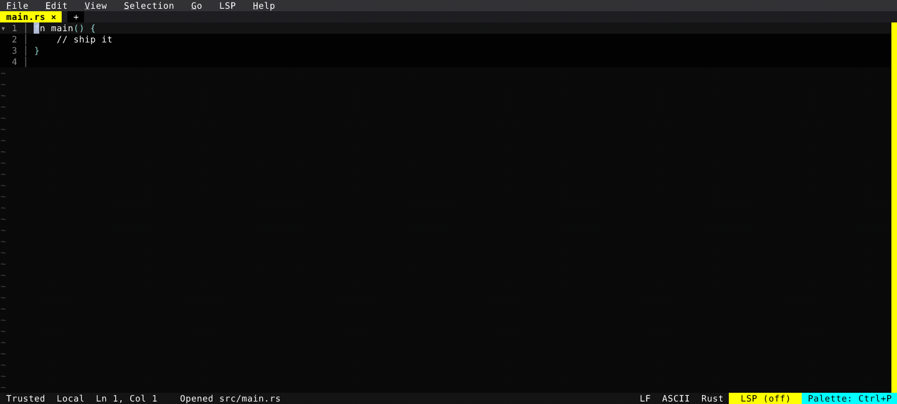

# Agent Sessions

The New Session dialog now knows about coding agents. Pick one from the Agent dropdown — agents tagged ↻ resume on restart, so a restart rejoins the running agent instead of relaunching it.

  

<!-- Generated by: cargo test --package fresh-editor --test e2e_tests blog_showcase_fresh_0_4_0_agent_sessions -- --ignored -->
<!-- Then run: scripts/frames-to-gif.sh docs/blog/fresh-0.4.0/agent-sessions -->
