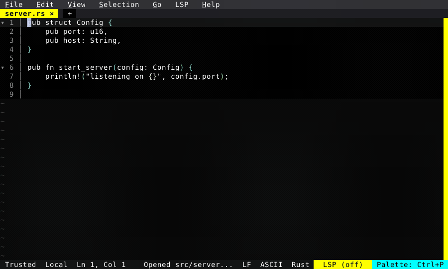

# Live Diff

A unified diff rendered right inside the editable buffer, updating as the file changes: added lines get a + gutter, edited lines show the old text above the new. Point it at HEAD, the file on disk, or a branch — handy for watching an agent rewrite a file under you.

  

<!-- Generated by: cargo test --package fresh-editor --test e2e_tests blog_showcase_fresh_0_4_0_live_diff -- --ignored -->
<!-- Then run: scripts/frames-to-gif.sh docs/blog/fresh-0.4.0/live-diff -->
