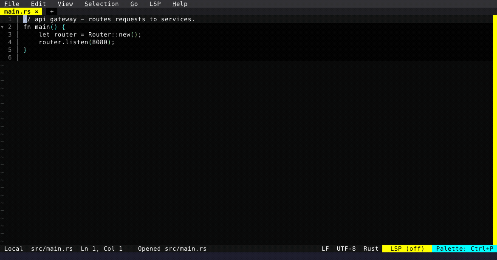

# The Orchestrator Dock

A persistent, non-modal left-column session switcher: every session in one process, each row showing project, branch, and status. The arrow keys live-switch the active session.

  

<!-- Generated by: cargo test --package fresh-editor --test e2e_tests blog_showcase_fresh-0.4.0/orchestrator-dock -- --ignored -->
<!-- Then run: scripts/frames-to-gif.sh docs/blog/fresh-0.4.0/orchestrator-dock -->
