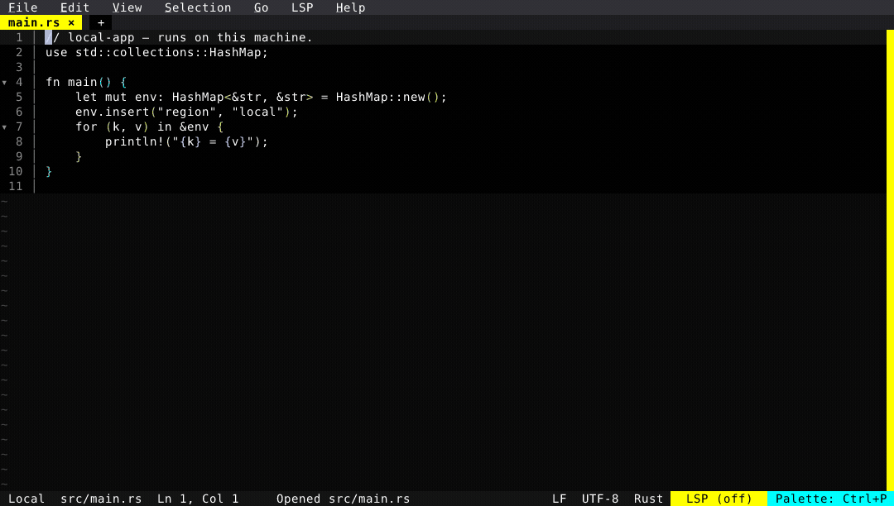

# New SSH Session

The Orchestrator's **New Session** dialog now opens remote sessions over SSH. Pick the **SSH** backend from the "Run in:" tabs, give it a host — a bare `host`, `user@host:port`, or a pasted `ssh://…` — and an optional identity file or extra ssh options (`-J jump`, `-o ProxyCommand=…`). Fresh dials the host, bootstraps its agent, and attaches a born-attached window whose filesystem, integrated terminal, and LSP all run on the far side of the connection.

The demo below connects to `demo-box`, a fake hostname pointed at a throwaway, user-space `sshd` via `/etc/hosts`. The session that opens is genuinely remote: the prompt is the remote login shell rooted at the workspace, and Quick Open (`Ctrl+P`) fuzzy-finds and opens a remote file (`app.py`) straight into a buffer. Finally, the persistent **dock** (`Orchestrator: Toggle Dock`) lists every session side by side, so a single `↑` hops back from the remote box to the local project — each session keeping its own open files.

  

Learn more: [Remote Editing over SSH](/features/ssh).

<!-- Generated by: cargo test --package fresh-editor --test e2e_tests blog_showcase_fresh_0_3_10_ssh_session -- --ignored -->
<!-- Then run: scripts/frames-to-gif.sh docs/blog/fresh-0.4.0/ssh-session -->
