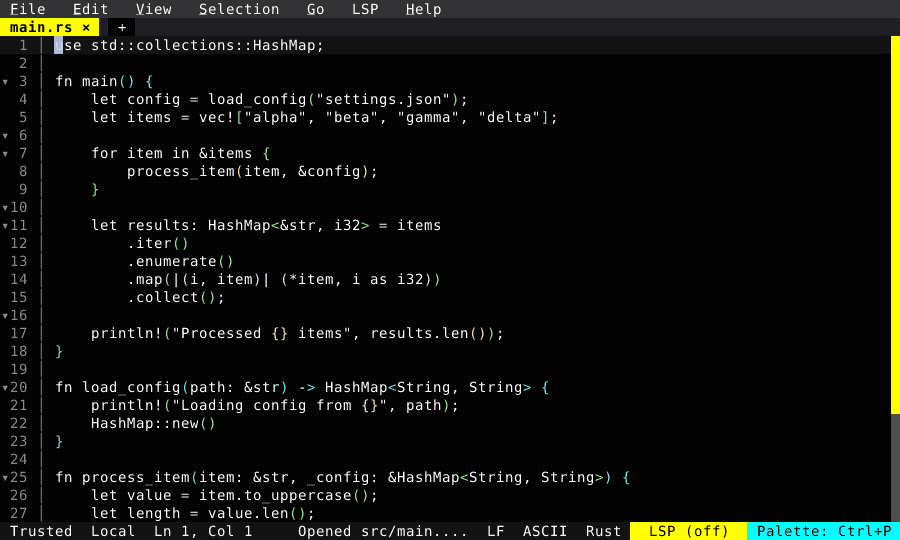

# Terminal Path Links

Run a build, a test, or a grep in the integrated terminal and Ctrl+Click any path:line in the output — including in scrollback — to jump straight to that file and line.

  

<!-- Generated by: cargo test --package fresh-editor --test e2e_tests blog_showcase_fresh_0_4_0_terminal_path_links -- --ignored -->
<!-- Then run: scripts/frames-to-gif.sh docs/blog/fresh-0.4.0/terminal-path-links -->
