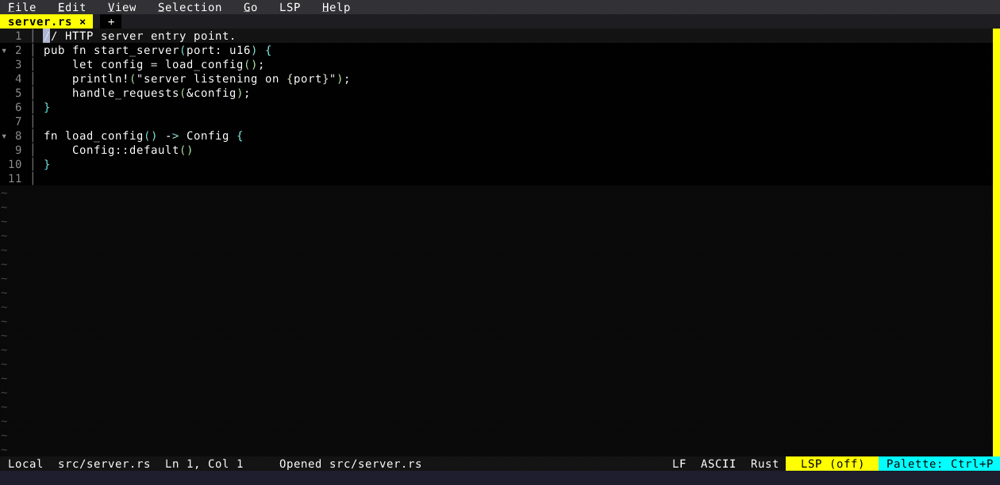

# Universal Search

Live Grep grew into a multi-scope search overlay — project files, open buffers, and terminal scrollback — with Word/Regex modes, a clickable scope toolbar, and a live syntax-highlighted preview.

  

<!-- Generated by: cargo test --package fresh-editor --test e2e_tests blog_showcase_fresh-0.4.0/universal-search -- --ignored -->
<!-- Then run: scripts/frames-to-gif.sh docs/blog/fresh-0.4.0/universal-search -->
